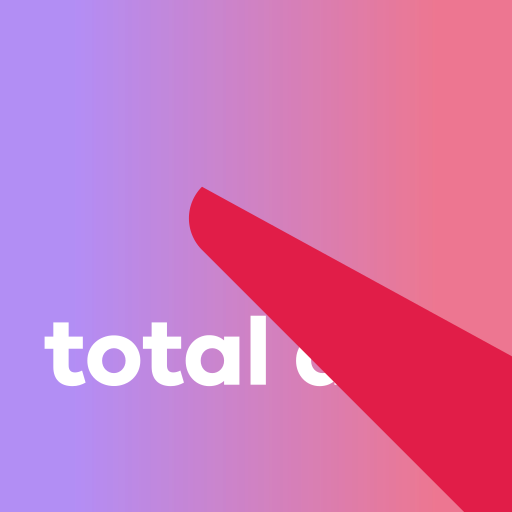

# Total App | Blank SvelteKit App

<!-- prettier-ignore -->
<table>
    <tbody>
        <tr>
            <td rowspan=2 style="vertical-align:bottom;">
                
            </td>
            <td align=center>Storybook</td>
            <td align=center><a href="https://app.netlify.com/sites/svelte-blank-20221125/deploys"></a></td>
            <td align=center><a href="https://vercel.com/iva2k/svelte-blank-20221125"></a></td>
        </tr>
        <tr>
            <td align=center><a href=https://www.chromatic.com/builds?appId=63839ed0e936a148379c5c65>Chromatic</a></td>
            <td align=center><a href="https://svelte-blank-20221125.netlify.app">App Demo</a></td>
            <td align=center><a href="https://svelte-blank-20221125.vercel.app">App Demo</a></td>
        </tr>
    </tbody>
</table>

<!--  -->

## + Tauri + Capacitor + Storybook + Prettier + ESLint + Stylelint + Postcss + Playwright + Vitest + Netlify + Vercel

A cross-platform Desktop / Mobile / Web application starter.

License: Mozilla Public License Version 2.0

This app has very little functionality. Huh? Why? - It is a starter app and it demonstrates the technology stack, main point is it can be deployed from a single codebase to any platform. Yes, ANY platform:

- iOS
- Android
- Windows
- MacOS
- Linux
- Web

Is it Native? - No. It uses JavaScript / TypeScript and modern tooling to create blazingly fast websites, web apps, and allow installation as apps on any of the major platforms.

Out of the box features:

- SEO and integration with Social Networks (coming next)
- Offline mode / can work without Internet connection (after the user visits the app when connected, the app's service worker caches all files for offline operation).
- Support native features (camera, GPS, etc.) - Capacitor included. Check Geolocation and QR Scanner tabs.
- Support deep links, in online and in offline modes.
- Codebase support features - Linting, Formatting, Unit Testing, End-to-End testing.
- Prepared for Isolated Component Development (Storybook).
- Instrumented for quick deployment - Netlify, Vercel, NGINX, etc.

<!-- prettier-ignore -- >
|Storybook| [](https://app.netlify.com/sites/svelte-blank-20221125/deploys) |  [](https://vercel.com/iva2k/svelte-blank-20221125) |
|:-:|:-:|:-:|
|[Chromatic](https://www.chromatic.com/builds?appId=63839ed0e936a148379c5c65)| [App Demo](https://svelte-blank-20221125.netlify.app) | [App Demo](https://svelte-blank-20221125.vercel.app)  |
<!-- -->

Built with:

- [Svelte](https://svelte.dev) - Truly reactive Javascript/TypeScript App UI framework
- [Svelte Kit](https://kit.svelte.dev) - Javascript/TypeScript App build system
- [Tauri](https://tauri.studio) - Desktop Application framework
- [Capacitor](https://capacitorjs.com) - Building crossplatform apps
- [Storybook](https://storybook.js.org) - Tool for building UI components and pages in isolation
- [Prettier](https://prettier.io/) - Opinionated Code Formatter
- [ESLint](https://eslint.org) - Pluggable JavaScript linter
- [Stylelint](https://stylelint.io/) - A mighty, modern CSS linter
- [Postcss](https://postcss.org/) - Transforming styles with JS plugins
- [Playwright](https://playwright.dev) - Fast and reliable end-to-end testing for modern web apps
- [Vitest](https://vitest.dev) - A blazing fast unit test framework powered by Vite

Continuous Integrations and Deployments:

- [Chromatic](https://www.chromatic.com) - Storybook Github CI
- [Netlify](https://svelte-blank-20221125.netlify.app) - App Demo
- [Vercel](https://svelte-blank-20221125.vercel.app) - App Demo

## Install

### Quick Start

To start with this app as a template:

```bash
git clone https://github.com/iva2k/svelte-blank-20221125.git my-new-total-app
cd my-new-total-app
pnpm install
cp .env.EXAMPLE .env
pnpm run svelte:dev -- --open
```

... or do the steps in [Start Your App](#start-your-app)

### Start Your App

To start your app from this project as a template:

```bash
mkdir my-app && cd my-app
npx degit iva2k/svelte-blank-20221125#ui-agnostic
# or
npx degit iva2k/svelte-blank-20221125#ui-bootstrap
# or
npx degit iva2k/svelte-blank-20221125#ui-bulma
# or ... (see other UI framework branches below)
```

### Or Clone the Repo

```bash
git clone https://github.com/iva2k/svelte-blank-20221125.git
cd svelte-blank-20221125
```

### Setup Configuration File

Copy provided `.env.EXAMPLE` to `.env` (may also create `.env.production` and `.env.dev` as needed) and modify it for your site.

`.env.*` files are listed in .gitignore to be never committed to the repo.

```bash
cp .env.EXAMPLE .env
```

When deploying your website to any provider (Netlify, Vercel), make sure to set all the variables listed in `.env.EXAMPLE` with the provider's UI to keep them secure.

## Developing Locally

Please follow the [Tauri Getting Started Guide](https://tauri.studio/en/docs/getting-started/intro#steps) to setup your system with the required Rust toolchain.

This application is built like a typical Node.js application. However, instead of `npm`, [`pnpm`](https://pnpm.io/) is used for package management.

> **Note:** You may use `yarn` or `npm`, but only a `pnpm` lockfile is included, and some scripts call `pnpm` directly and need to be changed to your package manager.

```bash
pnpm install # or npm install
```

### Start development server

```bash
pnpm run svelte:dev

# or start the development server and open the app in a new browser tab
pnpm run svelte:dev -- --open
```

## Building

To create a production version of the web app (to be hosted on a server):

```bash
pnpm run svelte:build
```

To preview the production build of the web app, execute `pnpm run preview`.

To deploy the app, need to install an [adapter](https://kit.svelte.dev/docs/adapters) for the target environment.

## Desktop App

To run desktop app (using Tauri)

```bash
pnpm run dev
```

To create desktop executable:

```bash
pnpm run build
```

## Mobile App

To update mobile app project (Android):

```bash
pnpm run svelte:build
cap open android
```

iOS platform is installed but not fully scripted in this repo, custom scripts can easily be added. See [CREATING](./CREATING.md)

## Customizing

Check file `src/lib/config/websiteFnc.js` for setting all information about the App / Website.

Many variables are also set in `.env` file.

## How This App Was Created

See [CREATING](./CREATING.md) for step-by-step instructions.

## Styling / UI Components

This template has DarkMode component in the header to allow switching the color scheme between 'light' and 'dark'. It has no effect until there's a theme added that supports `<html color-scheme>`.

There are many UI frameworks that work with Svelte / SvelteKit, and choice can be daunting.

<https://bestofsvelte.com/t/ui-library>

<https://sveltesociety.dev/components/>

This project has few of the top UI frameworks integrated in separate git branches:

<!-- prettier-ignore -->
| Git Branch | UI Framework | Dark Theme Switch | Notes |
|-|-|:-:|-|
| [ui-agnostic](../../tree/ui-agnostic)     | [AgnosticUI](https://github.com/AgnosticUI/agnosticui) | Y | |
| [ui-bootstrap](../../tree/ui-bootstrap)   | [Bootstrap](https://github.com/twbs/bootstrap) | Y | [Sveltestrap](https://github.com/bestguy/sveltestrap), Themes from [Bootswatch](https://github.com/thomaspark/bootswatch) |
| [ui-bulma](../../tree/ui-bulma)           | [Bulma](https://bulma.io/) | N | |
| [ui-carbon](../../tree/ui-carbon)         | [Carbon](https://carbon-components-svelte.onrender.com/) | Y | |
| [ui-framework7](../../tree/ui-framework7) | [Framework7](https://framework7.io/svelte/introduction.html) | N | Incomplete and currently broken |
| [ui-shoelace](../../tree/ui-shoelace)     | [Shoelace](https://shoelace.style/) | Y | |
|                                           | Smelte       |   | Material + TailwindCSS |
|                                           | TailwindCSS  |   | May use components - [Flowbite](https://flowbite.com/docs/getting-started/introduction/) |
|                                           | [Ionic](https://ionicframework.com) |   | See good [example](https://github.com/Tommertom/svelte-ionic-app) |
|                                           | [Chota](https://jenil.github.io/chota/) |   | [SvelteChota](https://alexxnb.github.io/svelte-chota/why_chota) |
| | [Svelterial](https://github.com/svelterialjs/svelterial) |   | [Svelte Materialify](https://github.com/TheComputerM/svelte-materialify) is on a deprecation path. |
| | [Tachyons](https://tachyons.io) |   | |
| | [Svelte Material](https://sveltematerialui.com/) |   | |
| | [Svelte Flat UI](https://svelteui.js.org/#/) |   | |
| | [Attractions](https://github.com/illright/attractions) |   | |

## Enjoy!


